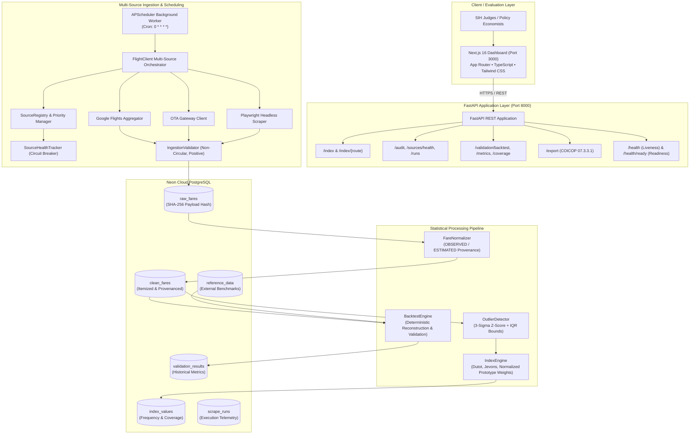

# MoSPI Airfare Index System (AirIndex India) — System Architecture

## 1. System Overview

AirIndex India is an automated, high-frequency civil aviation airfare data collection, statistical normalization, outlier filtering, elementary price index computation, and historical backtesting system designed for monitoring domestic passenger airfare inflation under the Ministry of Statistics and Programme Implementation (MoSPI) / National Statistical Office (NSO) Consumer Price Index (CPI) methodology (COICOP item `07.3.3.1`).

---

## 2. End-to-End Architecture Diagram

---

## 3. Core Component Breakdown

### 1. Multi-Source Ingestion Layer (`app/scraping/`)
* **`BaseScraper` Contract**: Standardized interface enforcing `search(...)` and `create_standard_quote(...)`.
* **`SourceRegistry`**: Dynamic priority ranking (`google_flights` $\to$ `ota_gateway` $\to$ `playwright_headless`).
* **`SourceHealthTracker`**: Circuit breaker tracking consecutive failures, query count, and latency.
* **`IngestionValidator`**: Drops $₹0$ quotes, circular routes (DEL-DEL), and malformed payloads before database storage.
* **Ethical Safeguards**: Bounded timeouts (15s), jittered backoff, respectful `AirIndexIndiaBot/1.0` User-Agent.

### 2. Statistical Processing Engine (`app/processing/`)
* **`FareNormalizer`**: Categorizes observation provenance into `OBSERVED`, `ESTIMATED`, and `REFERENCE`. Eliminates arbitrary GST/tax assumptions by tracking `fare_decomposition_status` (`EXACT`, `PARTIAL`, `UNAVAILABLE`).
* **`OutlierDetector`**: Flags extreme non-market anomalies using combined 3-Sigma standard deviation and Interquartile Range (IQR) fences.
* **`IndexEngine`**:
  * **Dutot Arithmetic Ratio**: $I_{0,t}^D = \left(\frac{\sum p_{i,t}}{\sum p_{i,0}}\right) \times 100$
  * **Jevons Geometric Ratio**: $I_{0,t}^J = \exp\left(\frac{1}{n} \sum \ln(p_{i,t}) - \frac{1}{n} \sum \ln(p_{i,0})\right) \times 100$
  * **Composite Aggregation**: Dynamic weight normalization across active routes:
    $$I_t = \frac{\sum_{r \in \mathcal{R}_t} w_r I_{r,t}}{\sum_{r \in \mathcal{R}_t} w_r}$$

### 3. Historical Backtesting Engine (`app/processing/backtest_engine.py`)
* Reconstructs historical index series deterministically from verified `OBSERVED` quotes.
* Computes standard statistical validation metrics: Mean Absolute Error (MAE), Root Mean Square Error (RMSE), Mean Absolute Percentage Error (MAPE), Pearson correlation, and Directional Agreement.
* Reconstructs 3 sensitivity scenarios: Baseline Clean, Unfiltered Outliers, and Estimated Inclusive.

### 4. Database Layer (Neon Cloud PostgreSQL)
* 6 dedicated relational tables with explicit indexes: `raw_fares`, `clean_fares`, `index_values`, `scrape_runs`, `reference_data`, and `validation_results`.

### 5. Next.js Dashboard (`frontend/`)
* 8 responsive dashboard views built with Next.js App Router, TypeScript, and Tailwind CSS.
* Zero hardcoded production data; all views consume the live FastAPI backend with error/loading boundaries.
